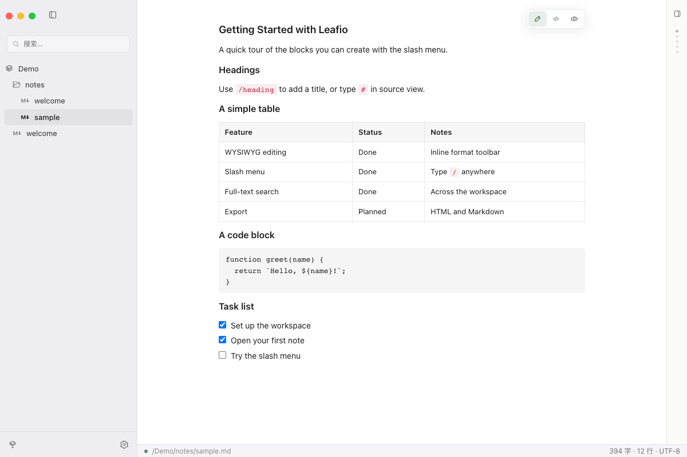

<h1>
  
  Leafio
</h1>

**English** · [中文](README.zh-CN.md)

Write freely in local Markdown files.

Open any folder and write headings, lists, tables, and code the way you would in a rich-text editor. What lands on disk is always standard `.md` — no library, no account, no proprietary format.

<picture>
  <source media="(prefers-color-scheme: dark)" srcset="docs/assets/screenshots/editor-dark.png">
  
</picture>

## Download

macOS, Windows, and Linux builds are on [Releases](https://github.com/jnetart/leafio/releases/latest).

| Platform | Package |
| --- | --- |
| macOS 12+ | `.dmg` · Apple Silicon / Intel |
| Windows 10+ | installer · x64 / ARM64 |
| Linux | `.AppImage` · x64 / ARM64 (Release also has `.deb` / `.rpm`) |

If macOS says the app cannot be opened, Control-click it in Finder and choose Open.

## Writing

Type `/` to insert or convert blocks. Select text and a format bar appears. Switch Edit, Source, and Preview at any time.

Search filenames and body text across the workspace, or narrow with `tag:meeting` and `path:notes`. Images are stored in a folder next to the note. Export is standard Markdown or self-contained HTML.

More UI detail and shortcuts: [`docs/features`](docs/features/index.html) and [`docs/guide`](docs/guide/index.html).

## Run from source

Needs **Node.js 22** and a stable **Rust** toolchain.

```bash
npm install
npm run dev
```

Frontend only: `npm run dev:web`. Tests: `npm test`. Package: `npm run build`.

The desktop shell is Tauri 2; the editor is TipTap. Files are read and written on disk. Core editing does not need a network.
